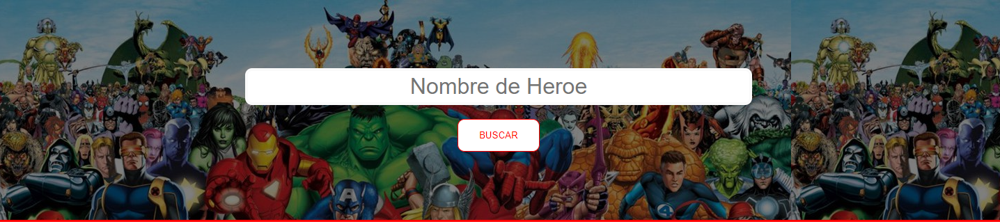
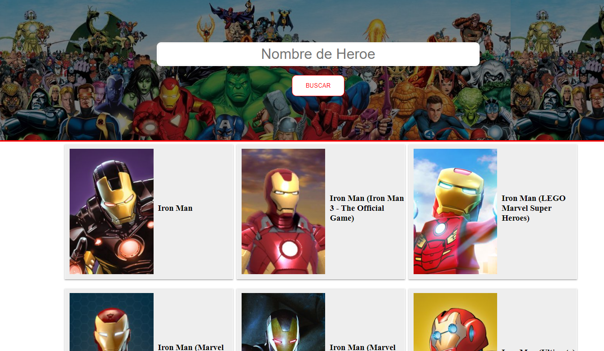

## Sobre el Proyecto:

Creado como practica personal ante los conocimientos adquiridos referentes a React. Se trata de una barra de busqueda empleando la API de Marvel.

## Conocimientos Empleados:

* HTML
* CSS
* Javascript
* NPM
* Yarn
* React
* ReactDOM
* Sass
* JSX

## TODO:

* Responsive Design

## Instalacion

1. Instalar proyecto:

`npm install`

2. Inicializar servidor:

`npm run start` o `yarn start`

3. Inicializar compilador de sass (Dev Only):

`npm run sass`

## Imagenes de referencia:

1. Primera vista:

2. Buscador Funcional:

---
## About the proyect:

Created as a personal practice given the knowledge acquired regarding React. It is a search bar using the Marvel API.

## Knowledge Employees:

* HTML
* CSS
* Javascript
* NPM
* Yarn
* React
* ReactDOM
* Sass
* JSX

## TODO:

* Responsive Design

## Instalation

1. Install project:

`npm install`

2. Initialize server

`npm run start` o `yarn start`

3. Initialize sass compiler (Dev Only):

`npm run sass`

## Imagenes de referencia:

1. First View:

2. Funtional Searcher:

